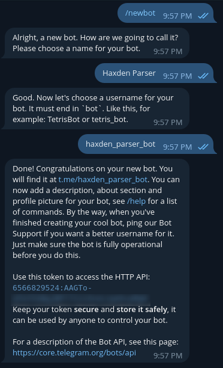
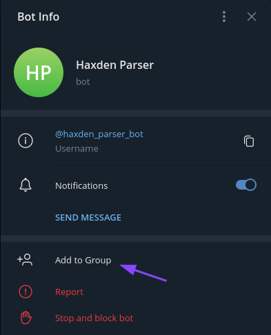
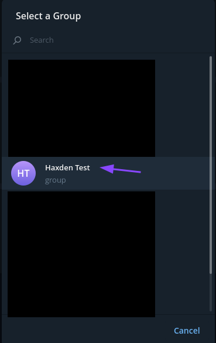
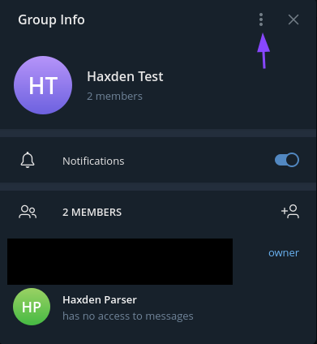
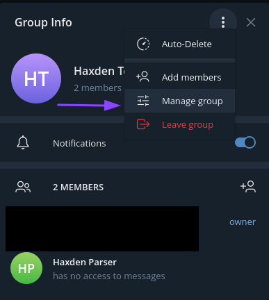
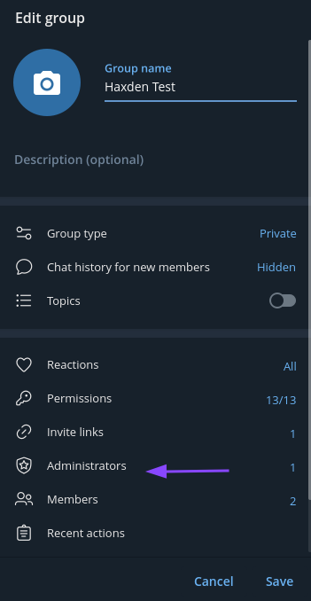
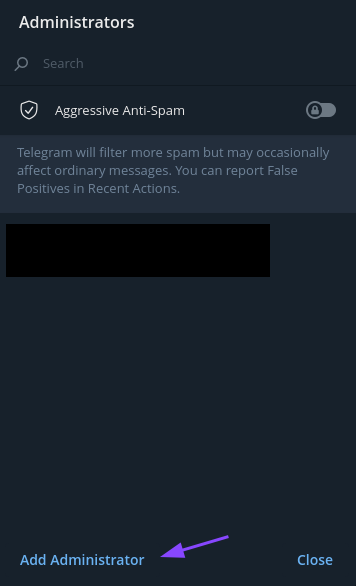
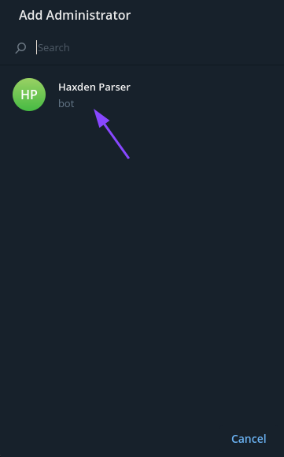
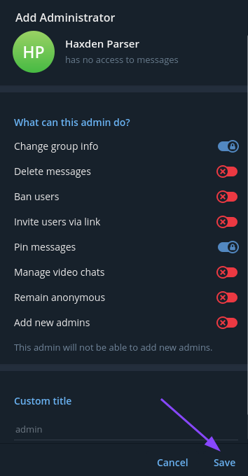

# Haxden
Hax.co.id & Woiden.id parser with Telegram notification.

## What does this app use
For Telegram API it uses _https://api.telegram.org_.

For getting pages it uses _requests_ library.

For parsing it uses _BeautifulSoup_ library.

For storing API key and group id it uses _.env_

## How it works
On first start (when there isn't .env) it will ask you to create a bot and enter the API key. After that, it will wait 
for the bot to be added to a group with administrator rights.

Then it will start parsing. When it found available server it will send notification and will stop parsing.

## Bot creation guide
Go to @BotFather and send /newbot command. Choose name and username for bot. Then you will get API key



Then you need to enter that API key to app (**and only then add bot to group!**).
You need to create group (no matter private or public). Then you need to add bot to group as admin.
### Step-by-step guide adding bot to group
<details><p>


















</p></details>

## Install
```
$ git clone https://github.com/kolbanidze/haxden
$ cd haxden
$ pip install -r requirements.txt
```
## Usage
```
python main.py
```
or
```
python3 main.py
```